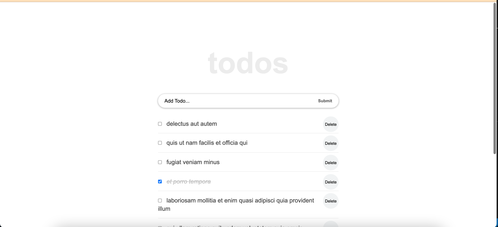

# react-toDoList

"react-toDoList" is a website for all fans of Todos. It is a Single Page App (SPA) that allows users to:
Add todos.
Navigate the page.

## Built With

-  React, CSS, JavaScript
-  Visual Studio Code: A source code editor
-  Git: A tool for managing source code

## Live Demo

[Live Demo Link](https://mustabbas.github.io/react-toDoList/)

## Getting Started

Download the ZIP from this [Link](https://github.com/mustabbas/react-toDoList), or run the following git command to clone the files to your machine:

git clone https://github.com/mustabbas/react-toDoList.git

## Authors

👤 **MUSTAFA ABBAS**

- GitHub: [@githubhandle](https://github.com/mustabbas)
- LinkedIn: [LinkedIn](https://www.linkedin.com/in/mustafa-abbas-7555ba10a)

## 🤝 Contributing

Contributions, issues, and feature requests are welcome!

Feel free to check the [issues page](https://github.com/mustabbas/react-toDoList/issues).

## Show your support

Give a ⭐️ if you like this project!

## 📝 License

This project is [MIT](./MIT.md) licensed.
